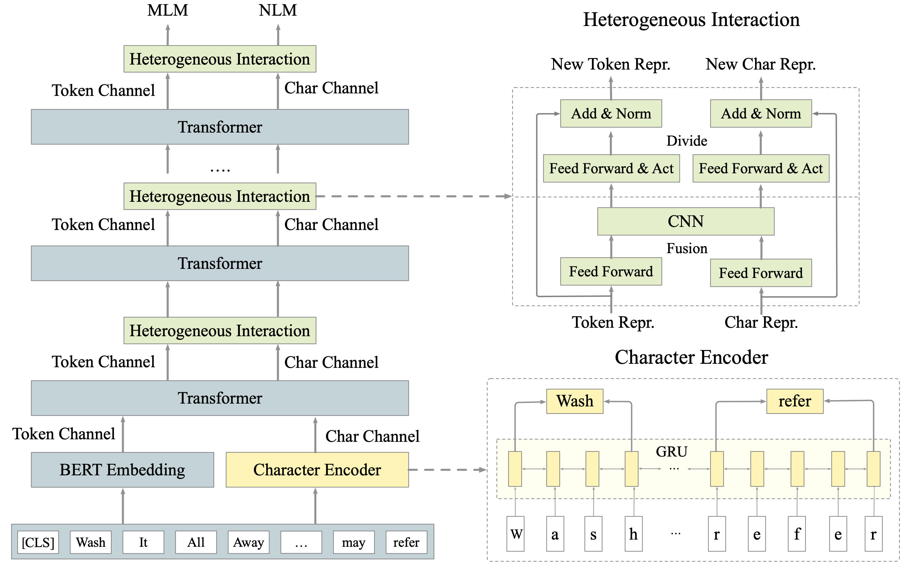

# CharBERT: Domain Adaptation and Multilingual QA Applications on Medical and Multilingual Datasets

##### by Francesco Giuseppe Gillio.
###### Department of Computer Science
###### Polytechnic University of Turin

## Abstract

[CharBERT](https://arxiv.org/abs/2011.01513), a character-aware version of [BERT](https://arxiv.org/abs/1810.04805), enhances word embeddings by incorporating character-level information to catch morphological variations. This research explores CharBERT performance for Question Answering (QA) tasks, with an emphasis on multilingual and domain adaptation contexts. The exploration refines CharBERT on domain-specific datasets ([BioASQ](https://huggingface.co/datasets/kroshan/BioASQ) for QA in a medical framework), language-specific datasets ([MLQA](https://huggingface.co/datasets/facebook/mlqa) for QA in a multilingual environment), and measures the model’s effectiveness in managing data with typos or morphological variations. The extensive experimentation reveals CharBERT’s high performance in addressing state-of-the-art problems. The findings underscore the value of incorporating character-level information in QA tasks, leading to higher resilience across multiple languages and diverse contexts. In addition, the results reveal the effective adaptation of CharBERT to domain-specific and multilingual applications with morphological variations and typos in the data.



## Setup for Google Colab

Clone the repository and install the system requirements by running the following commands:

```python
!git clone https://github.com/305909/charbert.git
!bash charbert/requirements.sh
```

## Datasets

- [Wikipedia](https://huggingface.co/datasets/legacy-datasets/wikipedia)
- [SQuAD](https://huggingface.co/datasets/rajpurkar/squad_v2)
- [PubMED](https://huggingface.co/datasets/ncbi/pubmed)
- [BioASQ](https://huggingface.co/datasets/kroshan/BioASQ)
- [MLQA](https://huggingface.co/datasets/facebook/mlqa)

## Notebook Structure

`main.ipynb` notebook contents:

- Baseline Evaluation:
  - Fine-Tuning the pre-trained language model, [bert-base-cased](https://huggingface.co/google-bert/bert-base-cased), on the English [Wikipedia](https://huggingface.co/datasets/legacy-datasets/wikipedia) dataset via Masked Language Modeling (MLM) approach to enhance the model’s comprehension performance in English.
  - ```python
    PATH = ...
    OUTPUT = PATH + '/wikipedia-en'
    direct(OUTPUT)

    !python3 /content/charbert/CharBERT/LM.py \
        --model_type bert \
        --model_name_or_path bert-base-cased \
        --do_train \
        --do_eval \
        --train_data_file /content/charbert/data/wikipedia/en_train.txt \
        --eval_data_file  /content/charbert/data/wikipedia/en_validation.txt \
        --char_vocab /content/charbert/data/dict/bert_char_vocab \
        --term_vocab /content/charbert/data/dict/term_vocab \
        --learning_rate 3e-5 \
        --num_train_epochs 2 \
        --mlm_probability 0.10 \
        --input_nraws 1000 \
        --per_gpu_train_batch_size 4 \
        --per_gpu_eval_batch_size 4 \
        --save_steps 10000 \
        --block_size 384 \
        --overwrite_output_dir \
        --mlm \
        --output_dir {OUTPUT}
    ```
  - Fine-Tuning the model on the [SQuAD](https://huggingface.co/datasets/rajpurkar/squad_v2) dataset via Question Answering approach to refine the model’s performance in English QA tasks.
  - ```python
    PATH = ...
    OUTPUT = PATH + '/SQuAD'
    direct(OUTPUT)

    !python3 /content/charbert/CharBERT/SQuAD.py \
        --model_type bert \
        --model_name_or_path bert-base-cased \
        --do_train \
        --do_eval \
        --train_file /content/charbert/data/SQuAD/SQuAD_train.json \
        --predict_file /content/charbert/data/SQuAD/SQuAD_validation.json \
        --char_vocab /content/charbert/data/dict/bert_char_vocab \
        --learning_rate 3e-5 \
        --num_train_epochs 2 \
        --per_gpu_train_batch_size 4 \
        --per_gpu_eval_batch_size 4 \
        --save_steps 2000 \
        --max_seq_length 384 \
        --overwrite_output_dir \
        --doc_stride 128 \
        --output_dir {OUTPUT}
    ```

- Domain Adaptation:
  - Fine-Tuning the pre-trained language model, [bert-base-cased](https://huggingface.co/google-bert/bert-base-cased), on the [PubMED](https://huggingface.co/datasets/ncbi/pubmed) dataset via Masked Language Modeling (MLM) approach to enhance the model’s comprehension performance in medical knowledge.
  - ```python
    PATH = ...
    OUTPUT = PATH + '/PubMED'
    direct(OUTPUT)

    !python3 /content/charbert/CharBERT/LM.py \
        --model_type bert \
        --model_name_or_path bert-base-cased \
        --do_train \
        --do_eval \
        --train_data_file /content/charbert/data/PubMED/PubMED_train.txt \
        --eval_data_file  /content/charbert/data/PubMED/PubMED_validation.txt \
        --char_vocab /content/charbert/data/dict/bert_char_vocab \
        --term_vocab /content/charbert/data/dict/term_vocab \
        --learning_rate 3e-5 \
        --num_train_epochs 2 \
        --mlm_probability 0.10 \
        --input_nraws 1000 \
        --per_gpu_train_batch_size 4 \
        --per_gpu_eval_batch_size 4 \
        --save_steps 10000 \
        --block_size 384 \
        --overwrite_output_dir \
        --mlm \
        --output_dir {OUTPUT}
    ```
  - Fine-Tuning the model on the [BioASQ](https://huggingface.co/datasets/kroshan/BioASQ) dataset via Question Answering approach to refine the model’s performance in medical QA tasks.
  - ```python
    PATH = ...
    OUTPUT = PATH + '/BioASQ'
    direct(OUTPUT)

    !python3 /content/charbert/CharBERT/SQuAD.py \
        --model_type bert \
        --model_name_or_path bert-base-cased \
        --do_train \
        --do_eval \
        --train_file /content/charbert/data/BioASQ/BioASQ_train.json \
        --predict_file /content/charbert/data/BioASQ/BioASQ_validation.json \
        --char_vocab /content/charbert/data/dict/bert_char_vocab \
        --learning_rate 3e-5 \
        --num_train_epochs 2 \
        --per_gpu_train_batch_size 4 \
        --per_gpu_eval_batch_size 4 \
        --save_steps 2000 \
        --max_seq_length 384 \
        --overwrite_output_dir \
        --doc_stride 128 \
        --output_dir {OUTPUT}
    ```

- Multilingual Context:
  - Fine-Tuning the pre-trained multilingual language model, [bert-base-multilingual-cased](https://huggingface.co/google-bert/bert-base-multilingual-cased), on both English and German [Wikipedia](https://huggingface.co/datasets/legacy-datasets/wikipedia) datasets via Masked Language Modeling (MLM) approach to enhance the model’s comprehension performance in English and German.
  - ```python
    PATH = ...
    OUTPUT = PATH + '/wikipedia-en-de'
    direct(OUTPUT)

    !python3 /content/charbert/CharBERT/LM.py \
        --model_type bert \
        --model_name_or_path bert-base-multilingual-cased \
        --do_train \
        --do_eval \
        --train_data_file /content/charbert/data/wikipedia/en_de_train.txt \
        --eval_data_file  /content/charbert/data/wikipedia/en_de_validation.txt \
        --char_vocab /content/charbert/data/dict/bert_char_vocab \
        --term_vocab /content/charbert/data/dict/term_vocab \
        --learning_rate 3e-5 \
        --num_train_epochs 2 \
        --mlm_probability 0.10 \
        --input_nraws 1000 \
        --per_gpu_train_batch_size 4 \
        --per_gpu_eval_batch_size 4 \
        --save_steps 10000 \
        --block_size 384 \
        --overwrite_output_dir \
        --mlm \
        --output_dir {OUTPUT}
    ```
  - Fine-Tuning the model on the [MLQA](https://huggingface.co/datasets/facebook/mlqa) dataset via Question Answering approach to refine the model’s performance in English and German QA tasks.
  - ```python
    PATH = ...
    OUTPUT = PATH + '/MLQA'
    direct(OUTPUT)

    !python3 /content/charbert/CharBERT/SQuAD.py \
        --model_type bert \
        --model_name_or_path bert-base-multilingual-cased \
        --do_train \
        --do_eval \
        --train_file /content/charbert/data/MLQA/MLQA_train.json \
        --predict_file /content/charbert/data/MLQA/MLQA_validation.json \
        --char_vocab /content/charbert/data/dict/bert_char_vocab \
        --learning_rate 3e-5 \
        --num_train_epochs 2 \
        --per_gpu_train_batch_size 4 \
        --per_gpu_eval_batch_size 4 \
        --save_steps 2000 \
        --max_seq_length 384 \
        --overwrite_output_dir \
        --doc_stride 128 \
        --output_dir {OUTPUT}
    ```

- Noise Resilience Evaluation:
  - Fine-Tuning the model on the adversarial version of the [SQuAD](https://huggingface.co/datasets/rajpurkar/squad_v2) dataset via Question Answering approach to refine the model’s performance in English QA tasks with morphological variations and typos in the data.
  - ```python
    PATH = ...
    OUTPUT = PATH + '/SQuAD-attack'
    direct(OUTPUT)

    !python3 /content/charbert/CharBERT/SQuAD.py \
        --model_type bert \
        --model_name_or_path bert-base-cased \
        --do_train \
        --do_eval \
        --train_file /content/charbert/data/SQuAD/char_SQuAD_train.json \
        --predict_file /content/charbert/data/SQuAD/char_SQuAD_validation.json \
        --char_vocab /content/charbert/data/dict/bert_char_vocab \
        --learning_rate 3e-5 \
        --num_train_epochs 2 \
        --per_gpu_train_batch_size 4 \
        --per_gpu_eval_batch_size 4 \
        --save_steps 2000 \
        --max_seq_length 384 \
        --overwrite_output_dir \
        --doc_stride 128 \
        --output_dir {OUTPUT}
    ```
  - Fine-Tuning the model on the adversarial version of the [BioASQ](https://huggingface.co/datasets/kroshan/BioASQ) dataset via Question Answering approach to refine the model’s performance in medical QA tasks with morphological variations and typos in the data.
  - ```python
    PATH = ...
    OUTPUT = PATH + 'BioASQ-attack'
    direct(OUTPUT)

    !python3 /content/charbert/CharBERT/SQuAD.py \
        --model_type bert \
        --model_name_or_path bert-base-cased \
        --do_train \
        --do_eval \
        --train_file /content/charbert/data/BioASQ/char_BioASQ_train.json \
        --predict_file /content/charbert/data/BioASQ/char_BioASQ_validation.json \
        --char_vocab /content/charbert/data/dict/bert_char_vocab \
        --learning_rate 3e-5 \
        --num_train_epochs 2 \
        --per_gpu_train_batch_size 4 \
        --per_gpu_eval_batch_size 4 \
        --save_steps 2000 \
        --max_seq_length 384 \
        --overwrite_output_dir \
        --doc_stride 128 \
        --output_dir {OUTPUT}
    ```
  - Fine-Tuning the model on the adversarial version of the [MLQA](https://huggingface.co/datasets/facebook/mlqa) dataset via Question Answering approach to refine the model’s performance in English and German QA tasks with morphological variations and typos in the data.
  - ```python
    PATH = ...
    OUTPUT = PATH + 'MLQA-attack'
    direct(OUTPUT)

    !python3 /content/charbert/CharBERT/SQuAD.py \
        --model_type bert \
        --model_name_or_path bert-base-multilingual-cased \
        --do_train \
        --do_eval \
        --train_file /content/charbert/data/MLQA/char_MLQA_train.json \
        --predict_file /content/charbert/data/MLQA/char_MLQA_validation.json \
        --char_vocab /content/charbert/data/dict/bert_char_vocab \
        --learning_rate 3e-5 \
        --num_train_epochs 2 \
        --per_gpu_train_batch_size 4 \
        --per_gpu_eval_batch_size 4 \
        --save_steps 2000 \
        --max_seq_length 384 \
        --overwrite_output_dir \
        --doc_stride 128 \
        --output_dir {OUTPUT}
    ```

## Results

The results section presents performance metrics such as F1-score and Exact Match (EM) for Q&A tasks on different datasets and CharBERT versions. For more details, see the `paper.pdf` file.

## References

- [CharBERT](https://arxiv.org/abs/2011.01513)
- [BERT](https://arxiv.org/abs/1810.04805)
- [Hugging Face](https://huggingface.co/datasets)
